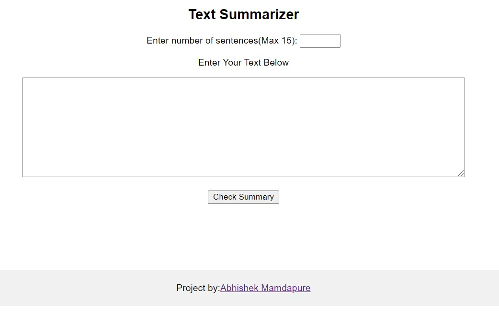

# TL;DR(Too Long; Didn't Read)-using-NLTK

## Check the project in action here : https://tldr-summary-api.herokuapp.com/

- This project is based on the concept of "sentence similarity", where summary is generated based on the rank of sentences from the input text given. 

